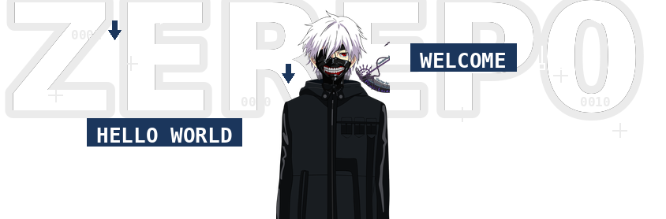

<body>

  

<h1 align="center">Hello 👋, I'm Antonio</h1>
<h3 align="center">Full-Stack / DevOps · Turning ideas into software · Always learning</h3>

  
  
  
  

---

## 🧠 About me

  I'm a Software Engineer in training focused on building solid, maintainable systems.
  I enjoy turning ideas into real products and improving them through architecture,
  testing and automation.

  

  <ul>
    
    
    <li>✦ <b>Full-Stack / DevOps</b> · learning every day and shipping features.</li>
    <li>✦ Ask me about <b>DDD / Clean Architecture</b>, <b>microservices</b>, and frontend/backend design.</li>
    <li>✦ Languages: <b>Spanish (native)</b> · English and French (improving).</li>
    <li>✦ Fun fact: I can spend more time polishing Docker/CI than writing the endpoint… and enjoy it 😄</li>
  </ul>

 

 

## 🧰 What I know / what I'm learning

  

---

## 📌 Featured projects

- 🧪 **TFG** — repositorio académico  
  👉 https://github.com/Zerep0/TFG

- 🌐 **SolidarianID** — demo online  
  👉 https://solidarianid.com

---

  

